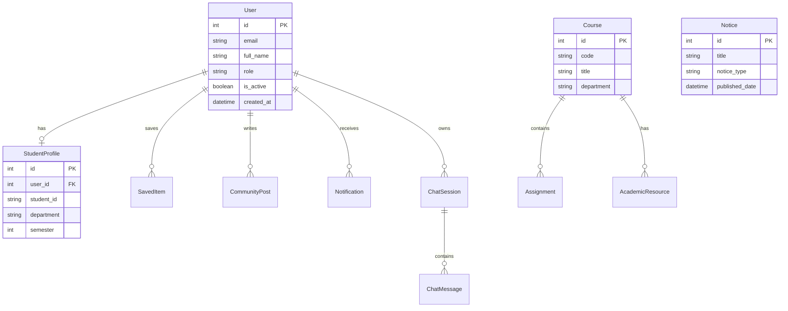

# CampusSync Entity-Relationship Diagram

```mermaid
erDiagram
    User ||--o| StudentProfile : has
    User ||--o{ SavedItem : saves
    User ||--o{ CommunityPost : writes
    User ||--o{ Notification : receives
    User ||--o{ ChatSession : owns
    
    Course ||--o{ Assignment : contains
    Course ||--o{ AcademicResource : has
    
    ChatSession ||--o{ ChatMessage : contains
    
    User {
        int id PK
        string email
        string full_name
        string role
        boolean is_active
        datetime created_at
    }
    
    StudentProfile {
        int id PK
        int user_id FK
        string student_id
        string department
        int semester
    }
    
    Course {
        int id PK
        string code
        string title
        string department
    }
    
    Notice {
        int id PK
        string title
        string notice_type
        datetime published_date
    }
```
